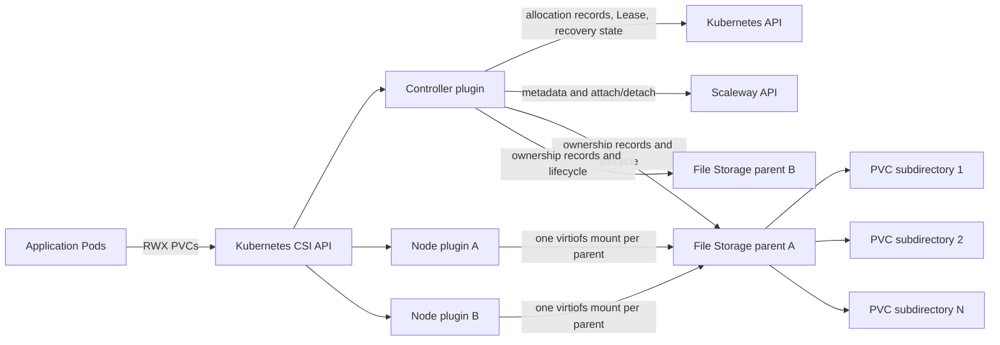
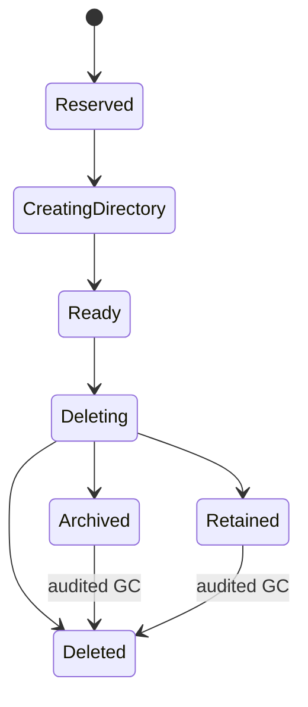

# Scaleway File Storage Subdirectory CSI Driver

[](https://github.com/urlab-ai/scaleway-file-storage-subdir-csi/actions/workflows/ci.yaml)
[](LICENSE)
[](#supported-production-envelope)

A production-grade community Kubernetes CSI driver that provisions many
isolated ReadWriteMany (RWX) PersistentVolumes as subdirectories inside a small,
explicit pool of existing Scaleway File Storage filesystems.

This project is created and maintained by [URLab](https://github.com/urlab-ai),
released under the MIT license, and is not an official Scaleway product.

> [!IMPORTANT]
> V1 has completed its full production qualification against real Scaleway
> Kapsule and File Storage. The qualified subject is the immutable
> `v0.1.0-rc.36` candidate. Stable SemVer publication must preserve the exact
> qualification binding; see [Release status](#release-status).

## Why this driver exists

Scaleway File Storage provides shared filesystems that can be mounted from
multiple Kubernetes nodes, but every physical filesystem consumes one of the
limited File Storage attachment slots available on an Instance. Mapping one PVC
to one physical filesystem therefore does not scale when a platform needs tens
or hundreds of independent shared volumes.

This driver moves that abstraction into CSI:

- administrators create and control a small pool of physical File Storage
  parents;
- every Kubernetes PVC receives its own durable, isolated subdirectory;
- many logical PVCs share one physical parent attachment on a node;
- applications use ordinary Kubernetes PVCs and never need to know the parent
  filesystem ID or directory path.

The production qualification mounted 100 PVCs, including 10 simultaneously
mounted logical volumes on one node through a single physical attachment, while
the qualified Instance type exposes only two File Storage slots.

## Architecture



The controller owns provisioning, pool accounting, parent attachment,
filesystem lifecycle, recovery, and operator workflows. The privileged node
DaemonSet mounts already-attached parents with `virtiofs`, then publishes only
the validated logical subdirectory requested by kubelet. Scaleway credentials
are available only to the controller; node plugins are credential-free.

Durable safety state deliberately uses a small set of standard components:

- Kubernetes ConfigMaps for allocation, reservation, operation, and recovery
  records;
- a Kubernetes Lease for controller ownership and fencing;
- a driver-owned logical-volume ownership record on the parent filesystem;
- one parent-global claim binding the parent to the installation and cluster;
- permanent tombstones preventing silent logical-volume name reuse.

V1 intentionally has one controller replica, no CRD, no external database, and
no automatic parent-filesystem manager.

## V1 capabilities

### Storage and Kubernetes

- Dynamic provisioning of isolated RWX subdirectory volumes.
- `ReadWriteMany` and `SINGLE_NODE_WRITER`, with cross-node conflict fencing
  for the single-writer mode and read-only Pod publication when requested.
- Multiple logical volumes per physical File Storage attachment.
- Multiple explicit parents per pool with least-allocated selection.
- Logical capacity reservations, free-space thresholds, and bounded
  overcommit configuration.
- Live refresh after an operator grows a parent filesystem.
- Non-default StorageClasses and a Helm deployment whose driver and CSI
  sidecars are pinned by immutable digest.
- Coexistence with the official Scaleway File Storage CSI driver using distinct
  driver and StorageClass identities.

### Data safety and lifecycle

- Fail-closed ownership checks: directory names alone never prove ownership.
- Descriptor-relative path operations that reject symlink swaps, foreign mount
  generations, stacked mounts, and mount-boundary crossings.
- Crash-safe dual records and filesystem durability barriers.
- Persistent published-node fences that block unsafe delete, archive, retain,
  and garbage collection.
- Idempotent CSI operations with explicit retry, cancellation, timeout, and
  ambiguous-provider handling.
- Permanent terminal tombstones and no logical-volume name reuse in V1.
- Three explicit delete behaviors:

| Kubernetes reclaim policy | CSI `onDelete` | Result |
| --- | --- | --- |
| `Delete` | `archive` | PV is deleted; data is moved to a protected archive path. |
| `Delete` | `delete` | PV and validated data directory are deleted. |
| `Delete` | `retain` | PV is deleted; data remains in a protected retained path. |

`archive` is the production default. Archived and retained volumes continue to
reserve logical capacity until audited garbage collection completes.

The allocation lifecycle is forward-only:



### Recovery and operations

- Normal controller replacement while preserving Lease identity.
- Fail-closed abnormal takeover requiring conclusive provider fencing and an
  explicit, one-use approval.
- Durable first-install parent bootstrap and exact same-Pod crash recovery.
- Namespace checkpoint export and same-cluster restore with digest-verified
  archives and complete pre-recovery Instance fencing.
- N/N-1 upgrade preflight, mixed-generation blocking, rollback, and convergence
  checks.
- Audited parent draining and decommissioning.
- Audited archive/retain garbage collection.
- Safe uninstall that removes workloads, mounts, attachments, driver Pods, and
  Helm objects in the required order without deleting external Secrets,
  tombstones, or user data.
- Prometheus metrics, health endpoints, bounded labels, and maintained sample
  alerts.

The matching, checksum-verifiable `csi-admin` binary implements checkpoint,
restore, upgrade preflight, garbage collection, parent decommission, and safe
uninstall workflows. Destructive operations use separate dry-run and execute
steps with stable request IDs.

## Production qualification

The exact V1 source, chart, release values, five immutable images, AMD64
binaries, Linux results, kind results, real Kapsule result, and final cleanup
inventory are bound by one canonical qualification manifest. The final real
cloud run completed all 14 scenarios continuously and removed every run-owned
billable resource.

| # | Qualifying scenario | What it proved |
| ---: | --- | --- |
| 1 | Artifact and install preflight | Exact commit, chart, values, image digests, security contexts, RBAC, CSI identity, and eligible nodes. |
| 2 | N-1 upgrade | RC14 to V1 upgrade, interrupted rollout rollback, mixed-generation fail-closed behavior, data and identity preservation. |
| 3 | Real `virtiofs` | Parent mount, `statfs`, logical volume, controller replacement, and persisted data. |
| 4 | Single-node-writer conflict | Second-node conflict rejection followed by clean handoff and read/write recovery. |
| 5 | 100-PVC scale and RWX soak | 100 Bound PVCs, multiplexing beyond the physical attachment limit, concurrent cross-node integrity, and restarts. |
| 6 | Provider attach/detach | Foreign attachment blocking, exact detach, retry, and durable bootstrap recovery. |
| 7 | Parent growth | Real parent resize from 100 GB to 200 GB, refreshed capacity, and new allocation. |
| 8 | Node drain and replacement | Normal drain, new Instance/node/plugin readiness, and persisted-data access. |
| 9 | Hard controller failure | Frozen and API-fenced controller, blocked successor, provider fencing, approved recovery, and continued data availability. |
| 10 | Parent decommission | Dry-run and execute audit, exact detach, configuration removal, preserved tombstones, and healthy remaining pool. |
| 11 | Checkpoint and restore | Quiesced export, namespace deletion, complete old-worker fencing, exact restore, old-data read, and new provisioning. |
| 12 | Missing-Lease recovery | Non-serving provisional controller, complete fencing scope, one-use approval, and stale/cross-cluster rejection. |
| 13 | Official CSI coexistence | Distinct drivers and StorageClasses, no release-object collision, and both official CSI node Pods ready. |
| 14 | Safe uninstall and cleanup | Workload/PV removal, fence clearing, exact unmount/detach, Helm/namespace removal, and seven cloud resources conclusively absent. |

### RWX stress evidence

The scale scenario used 10 active PVC pairs across two nodes for 1,204 seconds:

- 20 concurrent writers and 20 concurrent readers;
- 10,447 completed writes;
- 9,878 distinct cross-peer reads;
- zero checksum failures;
- successful new read/write operations after a controller restart;
- successful new read/write operations after node-plugin restarts;
- read-only enforcement verified;
- node containers verified free of Scaleway credentials.

### Verification stack

The release gates additionally include:

- unit, fake Kubernetes, fake Scaleway, fake clock, and fake mounter tests;
- `go test -race ./...`, `go vet`, `gofmt`, and `golangci-lint`;
- the pinned upstream Kubernetes CSI sanity suite;
- privileged Linux mount-namespace, mount-generation, symlink-race, exact
  unmount, and filesystem durability tests;
- Helm lint, schema, render, immutable-image, RBAC, and security-context tests;
- a disposable kind installation covering chart wiring, PVC lifecycle,
  controller/node restarts, deletion, and Kubernetes persistence adapters;
- deterministic AMD64 binary builds, SHA-256 manifests, SPDX SBOM, and SLSA
  provenance subjects;
- exact-ID cloud cleanup and an independent final Project inventory.

Qualification is intentionally bounded. It proves the supported production
envelope below; it does not claim that every Kubernetes version, region,
architecture, or Scaleway Instance type is supported.

## Supported production envelope

| Dimension | V1 support |
| --- | --- |
| Cloud | Scaleway Kapsule with the GA File Storage product |
| Region | `fr-par` |
| Qualified Kubernetes version | `v1.35.3` |
| Node architecture | Linux `amd64` only |
| Qualified Instance type | `POP2-HM-2C-16G` |
| CSI driver name | `file-storage-subdir.csi.urlab.ai` — immutable after first use |
| Parent filesystems | Existing, empty, dedicated File Storage filesystems owned exclusively by one installation |
| Controller | One replica with Lease-based coordination and `Recreate` rollout |
| Scheduling | At least two Ready, homogeneous eligible Linux nodes; all schedulable Linux nodes are eligible |
| Parent management | Operator-created and operator-resized; the driver never creates, resizes, or deletes parents |
| Volume expansion | PVC expansion is disabled in V1; parent upward growth is supported |
| Quotas | Logical reservations and free-space gates, not hard per-directory filesystem quotas |

V1 does not advertise CSI reader-only capability modes such as
`MULTI_NODE_READER_ONLY`; it supports read-only publication of an otherwise
supported mount capability.

Every eligible node must support the Linux mount and identity primitives checked
by startup, including `STATX_MNT_ID_UNIQUE`, `open_tree`, `move_mount`,
`mount_setattr`, `fsopen`, `fsconfig`, and `fsmount`. Unsupported nodes make the
driver fail closed before provisioning.

The official Scaleway CSI may coexist in the cluster, but it must not actively
manage File Storage volumes on this driver's workload nodes in the V1 support
contract.

## Public artifacts

- Source and issues: <https://github.com/urlab-ai/scaleway-file-storage-subdir-csi>
- Driver image: `ghcr.io/urlab-ai/scaleway-file-storage-subdir-csi`
- Helm chart: `oci://ghcr.io/urlab-ai/charts/scaleway-sfs-subdir-csi`
- Operator binary, checksums, SBOM, and provenance: matching GitHub Release
- CSI identity: `file-storage-subdir.csi.urlab.ai`

Production manifests render the driver and all CSI sidecars as
`repository@sha256:<digest>`. Never replace a digest with `latest` or a mutable
tag.

## Installation overview

The complete procedure and safety checks are in
[`docs/OPERATIONS.md`](docs/OPERATIONS.md). The following is an overview, not a
replacement for the preflight and release-specific values.

### 1. Create dedicated parent filesystems

Create at least two empty parents in `fr-par`. Size them for the expected
physical data footprint; PVC requests are logical reservations rather than hard
directory quotas.

```bash
scw file filesystem create \
  region=fr-par \
  name=sfs-subdir-pool-standard-01 \
  size=100GB

scw file filesystem create \
  region=fr-par \
  name=sfs-subdir-pool-standard-02 \
  size=100GB
```

Record both filesystem IDs. A parent must be empty, dedicated to one driver
installation, and must never be shared between installations or manually
edited after it has been claimed.

### 2. Configure least-privilege cloud access

Use a Scaleway IAM application scoped to the target Project with:

- `FileStorageReadOnly` for existing parent metadata;
- `InstancesFullAccess` for Instance inventory and File Storage attach/detach.

`InstancesFullAccess` is broader than ideal because Scaleway does not currently
provide a narrower attachment-only permission set covered by this release. The
driver does not require `FileStorageFullAccess`: it never creates, resizes, or
deletes parent filesystems.

The target Kapsule cluster must carry the `scw-filestorage-csi` tag at cluster
level, and every eligible node must use the qualified commercial type.

### 3. Create the privileged namespace and external Secrets

```bash
kubectl create namespace scaleway-sfs-subdir-csi
kubectl label namespace scaleway-sfs-subdir-csi \
  pod-security.kubernetes.io/enforce=privileged \
  pod-security.kubernetes.io/enforce-version=latest

kubectl -n scaleway-sfs-subdir-csi create secret generic \
  scaleway-sfs-subdir-csi-credentials \
  --from-literal=SCW_ACCESS_KEY="$SCW_ACCESS_KEY" \
  --from-literal=SCW_SECRET_KEY="$SCW_SECRET_KEY"

INSTALLATION_ID="$(uuidgen | tr '[:upper:]' '[:lower:]')"
kubectl -n scaleway-sfs-subdir-csi create secret generic \
  scaleway-sfs-subdir-csi-identity \
  --from-literal=installationID="$INSTALLATION_ID"
```

Back up the installation identity with the driver namespace and keep it stable
for the lifetime of every PV and tombstone. Do not pass raw credentials through
Helm values. The chart requires an existing credential Secret and mounts it
only in the controller.

### 4. Run the non-mutating installation preflight

Download the preflight script and exact release values from the matching GitHub
Release, then run:

```bash
./hack/install-preflight.sh \
  --namespace=scaleway-sfs-subdir-csi \
  --credentials-secret=scaleway-sfs-subdir-csi-credentials \
  --credentials-access-key=SCW_ACCESS_KEY \
  --credentials-secret-key=SCW_SECRET_KEY \
  --identity-secret=scaleway-sfs-subdir-csi-identity \
  --identity-key=installationID \
  --cluster-id=<kapsule-cluster-uuid> \
  --project-id=<scaleway-project-uuid> \
  --region=fr-par
```

The preflight checks namespace admission, Secret key names, Project and region,
Kapsule type, cluster tag, and the effective privileged Pod policy. It does not
print Secret values, persist an object, install Helm resources, or mutate a
Scaleway resource.

### 5. Install the immutable release chart

Use the release-specific values file. It carries the exact qualified driver,
sidecar digests, and commercial-type allowlist.

```bash
helm upgrade --install scaleway-sfs-subdir-csi \
  oci://ghcr.io/urlab-ai/charts/scaleway-sfs-subdir-csi \
  --version <release-version> \
  --namespace scaleway-sfs-subdir-csi \
  --values /absolute/path/values_<release-tag>.yaml \
  --set scaleway.region=fr-par \
  --set scaleway.defaultZone=fr-par-1 \
  --set scaleway.projectId=<scaleway-project-uuid> \
  --set scaleway.credentials.existingSecretName=scaleway-sfs-subdir-csi-credentials \
  --set installation.existingSecretName=scaleway-sfs-subdir-csi-identity \
  --set 'pools.standard.filesystems[0].id=<filesystem-id-1>' \
  --set 'pools.standard.filesystems[1].id=<filesystem-id-2>'
```

Do not install directly from the development chart in this repository: its safe
defaults intentionally reject production mode.

### 6. Provision an ordinary RWX PVC

```yaml
apiVersion: v1
kind: PersistentVolumeClaim
metadata:
  name: shared-data
spec:
  accessModes:
    - ReadWriteMany
  storageClassName: sfs-subdir-rwx
  resources:
    requests:
      storage: 10Gi
```

Kubernetes dynamically provisions a logical volume. Multiple Pods may mount the
same PVC from different eligible nodes and read or write the same data.

## Operating the driver

- [Operations guide](docs/OPERATIONS.md): installation, upgrades, recovery,
  checkpoint/restore, decommission, GC, and safe uninstall.
- [Architecture and trust boundaries](docs/ARCHITECTURE.md): data path,
  coordination, durable state, and security boundaries.
- [Troubleshooting](docs/TROUBLESHOOTING.md): fail-closed states and supported
  recovery procedures.
- [Prometheus alerts](docs/ALERTS.md): capacity, attachment, lifecycle,
  readiness, and fencing alerts.
- [Normative specification](docs/SPECIFICATION.md): authoritative behavior and
  safety invariants.

Never manually delete allocation, ownership, parent-claim, approval, progress,
or tombstone state. Never run `helm uninstall` before the matching
checksum-verified `csi-admin uninstall prepare` workflow has completed and its
audit has been retained.

## Security model

- All CSI requests, Kubernetes objects, provider responses, restored metadata,
  paths, and filesystem entries are treated as untrusted input.
- The driver never mutates or removes a path from its name alone.
- Destructive traversal never follows symlinks or crosses mount boundaries.
- Foreign, aliased, replaced, or stacked mounts are never unmounted.
- Unavailable, forbidden, stale, timed-out, or ambiguous reads are never treated
  as absence.
- Existing healthy mounts remain available during temporary controller or
  Scaleway API outages.
- Node Pods are privileged only for their mount responsibilities and receive no
  Scaleway credentials or Kubernetes API permissions.
- CSI images, sidecars, chart, operator binary, checksums, SBOM, and provenance
  are versioned together.

Please report vulnerabilities through the process in [`SECURITY.md`](SECURITY.md),
not through a public issue.

## Release status

[`v1.0.0`](https://github.com/urlab-ai/scaleway-file-storage-subdir-csi/releases/tag/v1.0.0)
is the stable production-qualified release. It was built from exact commit
`631c81ba0ca62513cc703a656e88a35afac90eff`, qualified on 2026-08-03, and
published without rebuilding or transforming the tested artifacts.

Its immutable driver image digest is:

```text
sha256:30d7c49fdc5951f50c6b92d782c25dd5ab338ceebc0d515ea36d680b3adf65c3
```

Its chart package SHA-256 is:

```text
fa6d77a06a5c88155f52b8407b41344b7ea3b35ce88f523b2c7947e938b5ee9b
```

Its canonical candidate-manifest digest is:

```text
sha256:5d2014e83dd3b4ead922dfe3203b9263a635c4d2d6f4e63303a9542e921c57de
```

Its retained qualification manifest has SHA-256:

```text
17e5b8a92f6d8aea15cb5dbaf6606942638bb0bb99d0639cbbbed066e0d2a51f
```

The public Git tag, binary `vendor_version`, image tag and digest, chart
version, release values, checksums, SBOM, provenance, and qualification
authority all identify this one coherent SemVer release.

## Development

The normal local verification subset is:

```bash
make fmt-check
make test
make test-race
make test-csi-sanity
make vet
make lint
make helm-lint
make helm-test
make test-install-preflight
```

`make test-kind` creates and removes a local disposable kind cluster and never
calls Scaleway. `make test-linux-privileged` requires Linux root in a private
mount namespace. Real Scaleway tests require a dedicated Project, an explicitly
approved exact plan, tagged disposable resources, retained evidence, and exact
cleanup; they are never run by GitHub Actions.

See [`CONTRIBUTING.md`](CONTRIBUTING.md) before opening a change.

## License

[MIT](LICENSE)
